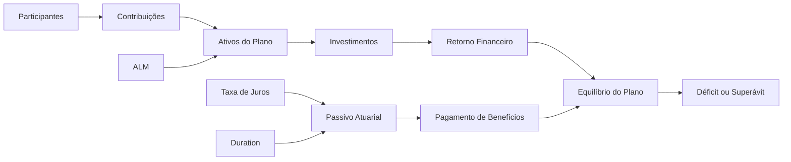

# analise-deficit-atuarial-efpc

# 📊 Análise de Déficits Atuariais e Estratégia de Investimentos em EFPC

## 🎯 Contexto e Objetivos

Este projeto tem como objetivo analisar os principais fatores que levam ao déficit atuarial em planos de Benefício Definido (BD) das Entidades Fechadas de Previdência Complementar (EFPC).

O estudo foca especialmente em planos maduros e saldados, explorando:

- As causas estruturais e conjunturais dos déficits atuariais  
- O impacto da maturidade dos planos (fluxo de caixa negativo)  
- O papel da duration atuarial na gestão de ativos e passivos (ALM)  
- A influência das taxas de juros no passivo atuarial  
- A relação entre estratégia de investimentos e solvência  
- O paradoxo de planos que atingem a meta atuarial, mas permanecem deficitários  

---

## 🏦 Visão Sistêmica do Plano

