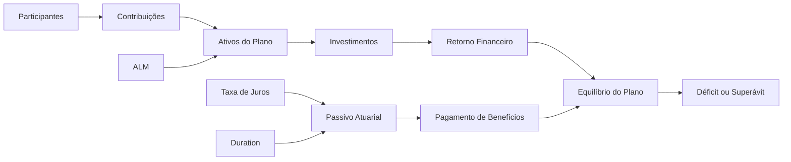

# analise-deficit-atuarial-efpc

# 📊 Análise de Déficits Atuariais e Estratégia de Investimentos em EFPC

## 🎯 Contexto e Objetivos

Este projeto tem como objetivo analisar os principais fatores que levam ao déficit atuarial em planos de Benefício Definido (BD) das Entidades Fechadas de Previdência Complementar (EFPC).

O estudo foca especialmente em planos maduros e saldados, explorando:

- As causas estruturais e conjunturais dos déficits atuariais  
- O impacto da maturidade dos planos (fluxo de caixa negativo)  
- O papel da duration atuarial na gestão de ativos e passivos (ALM)  
- A influência das taxas de juros no passivo atuarial  
- A relação entre estratégia de investimentos e solvência  
- O paradoxo de planos que atingem a meta atuarial, mas permanecem deficitários  

---

## 🏦 Visão Sistêmica do Plano

## 📚 Curadoria de Fontes
-	PREVIC – Publicações Oficiais
-	Relatório de Estabilidade da Previdência Complementar (REP)
-	Materiais técnicos sobre planos BD
-	Normativos CNPC (Resolução nº 30)
-	Diagnóstico de Investimentos – Mercer
-	Conteúdos institucionais da Abrapp
________________________________________

## 🧠 Engenharia de Prompts e Aprendizados
### 🔎 Perguntas Estratégicas
-	Quais são as principais causas de déficit em planos BD?
-	Como a duration atuarial impacta o risco em planos com fluxo negativo?
-	Por que planos continuam deficitários mesmo atingindo a meta atuarial?
-	Qual o impacto da queda da taxa de juros no passivo?
-	Por que EFPCs mantêm alta alocação em renda fixa?
________________________________________
## 🔁 Iterações de Prompts
### Prompt inicial:
>"Explique déficit atuarial em planos BD"

**Problema:**

Resposta genérica e pouco técnica

**Prompt refinado:**

>"Explique as causas de déficit em planos BD maduros e saldados considerando fluxo de caixa negativo e premissas atuariais"

**Resultado:**

Resposta mais profunda, técnica e aderente ao contexto brasileiro
________________________________________

## ⚠️ Dificuldades

-	Respostas genéricas sem contexto de EFPC
-	Necessidade de aprofundamento técnico (ALM, duration, ETA)
-	Iteração constante para ganho de qualidade
________________________________________
## 💡 Aprendizados

-	A qualidade do prompt define a qualidade da resposta
-	Contexto é fundamental
-	Iteração é parte do processo técnico
________________________________________

## 📊 Miniguia de Estudo

### 📌 Principais causas de déficit

-	Não atingimento da meta atuarial
-	Aumento da longevidade
-	Inflação sobre benefícios
-	Revisões judiciais
-	Mudanças biométricas
________________________________________
### 📌 Planos maduros
-	Envelhecimento da massa
-	Ausência de contribuições
-	Fluxo de caixa negativo
-	Dependência de rentabilidade
________________________________________
### 📌 Duration e risco
-	Mede o prazo médio das obrigações
-	Exemplo: duration ≈ 10 anos

**Impacto:**

-	Queda de 1% na taxa de juros → ↑ ~10% no passivo
-	Alta sensibilidade em planos maduros
________________________________________
### 📌 Estratégia de investimentos
-	Forte alocação em renda fixa (>90%)
-	Foco em títulos públicos

**Objetivo:**

✔ Imunização (ALM)

✔ Liquidez

**Trade-off:**

✔ Segurança

❌ Menor retorno potencial
________________________________________
### 📌 Ajuste de Precificação
-	Reduz volatilidade
-	Baseado em títulos até o vencimento

**Resultado:**

-	Equilíbrio Técnico Ajustado (ETA)
-	Possível equilíbrio mesmo com déficit contábil
________________________________________

### 📈 Insights do Projeto

-	Planos maduros priorizam solvência, não retorno
-	Duration elevada aumenta sensibilidade a juros
-	Déficit não implica insolvência (ETA é determinante)
-	Renda fixa é estratégia estrutural, não limitação
-	Ativos ilíquidos exigem maior critério em planos com fluxo negativo
________________________________________
### 📖 Glossário

-	BD: Benefício Definido
-	EFPC: Entidade Fechada de Previdência Complementar
-	Duration: Prazo médio das obrigações
-	ALM: Asset Liability Management
-	ETA: Equilíbrio Técnico Ajustado
-	Meta atuarial: Rentabilidade mínima necessária
________________________________________
### 🤖 Prompts Reutilizáveis

-	"Explique o impacto da duration no passivo atuarial de um plano BD"
-	"Simule o efeito da queda da taxa de juros em um plano com duration de 10 anos"
-	"Quais são as causas de déficit em planos BD maduros?"
-	"Como o ALM reduz riscos em EFPC?"
________________________________________
### 🚀 Conclusão

Os planos BD maduros enfrentam desafios estruturais relevantes:

-	Longevidade crescente
-	Sensibilidade à taxa de juros
-	Fluxo de caixa negativo

A sustentabilidade depende de:
-	Estratégias robustas de ALM
-	Disciplina na política de investimentos
-	Uso adequado de mecanismos regulatórios

Mesmo com déficits contábeis, o equilíbrio pode ser alcançado por meio de gestão técnica e prudente.
________________________________________

### 🧩 Sobre o Projeto

Projeto desenvolvido como parte de desafio prático da DIO, utilizando Inteligência Artificial(notebookLm) como ferramenta de aprendizagem ativa.

O trabalho combina:
-	Curadoria de fontes oficiais
-	Engenharia de prompts
-	Análise técnica
-	Estruturação de conhecimento
________________________________________
### Sugestão de Nome do Repositório
analise-deficit-atuarial-efpc
________________________________________

### 📝 Descrição (DIO)

Projeto focado na análise dos déficits atuariais em planos BD das EFPC, explorando duration, ALM, taxa de juros e estratégia de investimentos.
Utiliza IA(notebookLm) como ferramenta de aprendizado, combinando fontes oficiais com análise crítica e construção de miniguia técnico.
________________________________________

